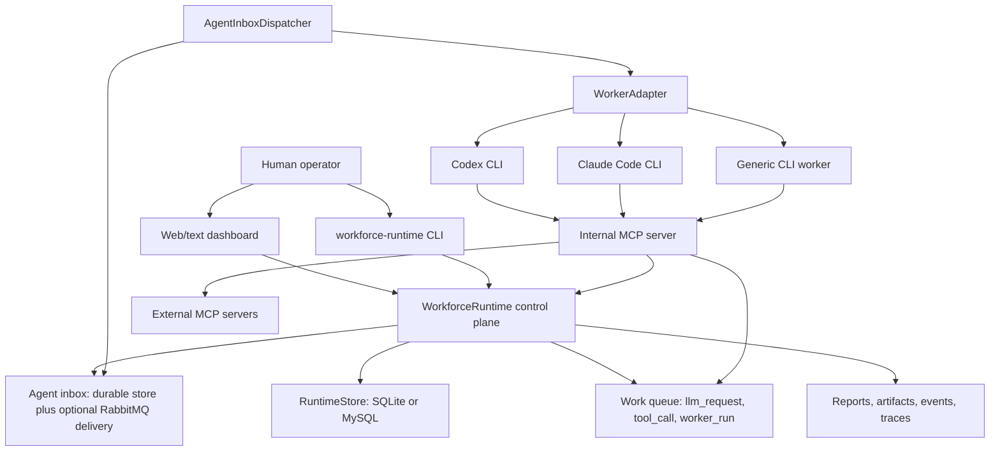

# Workforce Runtime

Workforce Runtime is an organization-level control plane for coordinating AI coding agents and other external workers. It gives Codex, Claude Code, generic CLI workers, and other executors a durable company structure: org chart, task contracts, manager review, MCP reporting, inbox messages, queued tool calls, budgets, permissions, artifacts, events, traces, and dashboards.

It does not replace the worker. It gives the worker a durable organization to work inside.

Public alpha validated with 148 automated tests and deterministic end-to-end demos.


[Standalone HTML animation source](docs/Workforce%20Runtime%20Animation%20%28standalone%29.html)

## At A Glance

- Organization runtime above third-party workers, not another single-agent prompt loop.
- Structured agent profiles, task contracts, reports, artifacts, clarifications, events, and trace exports.
- Central MCP server for worker-facing organizational tools, tool-call eventing, external MCP proxying, and permission checks.
- Persistent per-agent inbox for assignments, report reviews, clarifications, messages, human steering, and system notices.
- Persistent work queue for `llm_request`, `tool_call`, and `worker_run` items with leases, retries, idempotency, and concurrency limits.
- Worker adapters for generic CLI commands, Codex CLI, Claude Code CLI, and interactive Claude Code sessions.
- SQLite path for demos/tests, plus MySQL and RabbitMQ service backends for configured local deployments.
- Text and web dashboards for tasks, reports, artifacts, org state, worker output, queues, MCP settings, skills, traces, and human review.

The current package is `workforce-runtime` `0.1.0`, requires Python 3.11+, and ships the `workforce-runtime` CLI from `workforce_runtime.__main__:main`.

## See It In Motion

These short walkthroughs show how work moves through a Workforce Runtime organization.

### 1. Delegate One Goal Through the Organization

A high-level objective moves from the CEO to executives, managers, and specialized workers. Each layer breaks the goal into smaller, accountable tasks.

<div align="center">
  
</div>

### 2. Let Agents Request Missing Capabilities

When an agent cannot complete a task with its current tools, it can submit a formal tool request. An authorized manager, VP, CEO, or human can review the request and approve the capability.

<div align="center">
  
</div>

### 3. Compress Work Up the Reporting Chain

Workers report evidence and results to their direct managers. Managers review and summarize the work, and the CEO turns the organization’s output into a concise report for the human operator.

<div align="center">
  
</div>

### 4. Inspect Progress and Rebalance the Team

Managers can inspect the active work, reports, and recent events of their direct reports. They can move tasks away from overloaded agents, activate idle capacity, or add another agent when the team needs more help.

<div align="center">
  
</div>

### 5. Execute Tools Through a Controlled Boundary

Workers can run in a restricted environment. Tool calls may be queued, checked against permissions and concurrency rules, executed inside the configured sandbox, and recorded for audit.

<div align="center">
  
</div>

### 6. Detect Organizational Bottlenecks and Adapt

The experimental Governor analyzes organizational activity, identifies overloaded or missing capabilities, proposes a structural change, and can help reorganize work around the problem.

<div align="center">
  
</div>

## Architecture



The central server path is the core of the project: workers talk to the internal MCP server, MCP calls record runtime events, external MCP tools are exposed through centrally managed clone tools, tool calls can be queued as `tool_call` work items, and assignment/review traffic moves through durable per-agent inbox items. RabbitMQ is a broker for delivery; SQLite or MySQL remains the durable source of truth.

## Quickstart

```bash
python3 -m pip install --user uv
uv venv
source .venv/bin/activate
uv sync --extra dev
```

Run the deterministic public-alpha demo:

```bash
workforce-runtime --db .workforce_runtime/demo.sqlite demo sample-repo-fix
workforce-runtime --db .workforce_runtime/demo.sqlite dashboard --serve
```

Open the dashboard at `http://127.0.0.1:8765`.

## End-To-End Demo

`demo sample-repo-fix` uses `examples/mock_worker/fix_parser_worker.py`, so it does not require Codex, Claude Code, or provider credentials. The run creates a small engineering org, delegates a parser bug from human to CEO to VP to manager to worker, patches the sample repo, submits a diff and pytest log through MCP, creates a manager-review inbox item, exports traces, and ends with final status `completed`.

To inspect the resulting trace:

```bash
workforce-runtime --db .workforce_runtime/demo.sqlite task list
workforce-runtime --db .workforce_runtime/demo.sqlite task export-trace <task_id>
```

## What Workforce Runtime Is

This section explains what Workforce Runtime is in the current implementation: a management and governance layer above external worker processes. It persists the organization, routes tasks through managers, gives workers MCP tools for reporting and context, records evidence, controls queues, and keeps human operators in the loop.

## What Workforce Runtime Is Not

Workforce Runtime is not a replacement for Codex or Claude Code. It is not a single-agent prompt framework, a custom coding-agent loop, a browser automation product, a remote artifact store, or a hosted production scheduler.

## How It Differs From Ordinary Agent Frameworks

Ordinary agent frameworks usually focus on one worker loop: prompt assembly, planning, tool choice, execution, and retry. Workforce Runtime focuses on the organizational layer above those loops: who owns a task, who reports to whom, what the worker is allowed to do, which artifacts were produced, which manager reviewed the report, which tool calls or worker runs are waiting for a slot, and how a human operator can observe or steer the organization.

## Runtime Flow

1. A human, manager, or CLI command creates a `TaskContract`.
2. A manager assigns the task to a subordinate agent.
3. The runtime persists the task, records events, and enqueues an assignment in the assignee inbox.
4. `AgentInboxDispatcher` claims inbox items and starts the matching `WorkerAdapter`.
5. The adapter writes the task contract into the workspace, starts Codex, Claude Code, or a generic CLI process, and streams output into runtime events.
6. The worker calls MCP tools to read context, update docs, submit artifacts, report progress, request tools or permissions, and send a final report.
7. A final `report()` creates a manager-review inbox item.
8. The manager calls `review_report()` to accept, reject, retry, escalate, or request human review.
9. Trace export captures the task tree, reports, artifacts, docs, events, worker runs, and related files for audit.

<details>
<summary>Common Commands</summary>

Run demos:

```bash
workforce-runtime --db .workforce_runtime/demo.sqlite demo sample-repo-fix
workforce-runtime --db .workforce_runtime/simple.sqlite demo simple-status
workforce-runtime --db .workforce_runtime/web.sqlite demo web-research --workspace .workforce_runtime/demo/web-research
workforce-runtime --db .workforce_runtime/large-org-scale.sqlite demo large-org-scale --agent-count 3000 --active-agent-limit 20
```

Inspect state:

```bash
workforce-runtime --db .workforce_runtime/demo.sqlite dashboard
workforce-runtime --db .workforce_runtime/demo.sqlite dashboard --replay
workforce-runtime --db .workforce_runtime/demo.sqlite dashboard --trajectories
workforce-runtime --db .workforce_runtime/demo.sqlite dashboard --serve
```

Run with MySQL and RabbitMQ:

```bash
docker compose up -d workforce-mysql workforce-rabbitmq
cp examples/workforce_runtime_config.json workforce_runtime_config.json
workforce-runtime --config workforce_runtime_config.json dashboard --serve
```

Run the packaged container:

```bash
docker compose up --build workforce-runtime
```

Design an org:

```bash
workforce-runtime org design \
  --goal "Research a public RFC and produce an evidence-backed summary" \
  --headcount-limit 6 \
  --out .workforce_runtime/designed_org.yaml
```

Run the experimental V2 shadow-governance demo:

```bash
workforce-runtime --db .workforce_runtime/v2.sqlite v2 demo --out .workforce_runtime/v2-demo.json
```

</details>

<details>
<summary>Defining An Org Chart</summary>

An org chart is a YAML file with a `company` section and an `agents` list. Each agent can declare an id, name, role, department, manager, worker type, responsibilities, permissions, budget, status, model settings, and generated system prompt metadata.

See `examples/simple_engineering_org/org.yaml`.

```bash
workforce-runtime org print examples/simple_engineering_org/org.yaml
workforce-runtime --db .workforce_runtime/runtime.sqlite init --org examples/simple_engineering_org/org.yaml
```

The runtime validates duplicate agent ids, missing managers, and reporting cycles before saving the organization.

</details>

<details>
<summary>Adding A Worker Adapter</summary>

Worker adapters implement the protocol in `workforce_runtime/workers/base.py`. An adapter declares capabilities, starts a `TaskContract`, collects artifacts, stops a run, and reports usage.

Implemented adapter surfaces:

- `workforce_runtime/workers/generic_cli.py`: runs any command with a task JSON file and `WORKFORCE_*` environment variables.
- `workforce_runtime/workers/codex.py`: starts Codex CLI with the Workforce MCP server configured for the agent.
- `workforce_runtime/workers/claude_code.py`: starts Claude Code CLI with MCP configuration and run capture.
- `workforce_runtime/workers/claude_code_interactive.py`: PTY-based interactive Claude Code runner with live steering.
- `workforce_runtime/workers/process_runner.py`: shared process streaming, run logs, and output events.

A worker adapter should treat the runtime as the source of truth for task status, reports, artifacts, and events. It should call MCP tools rather than writing directly into storage.

</details>

<details>
<summary>MCP Reporting</summary>

Workers communicate with the organization through the internal MCP server:

```bash
workforce-runtime --db .workforce_runtime/demo.sqlite mcp serve
```

The main tool groups are:

- Assignment and status: `assign`, `update_status`, `check_progress`.
- Reporting and review: `report`, `review_report`, `report_to_human`.
- Context, docs, and artifacts: `get_task_dossier`, `get_task_context`, `get_org_context`, `upsert_task_doc`, `submit_artifact`.
- Clarifications and human escalation: `ask_clarification`, `escalate_clarification`, `answer_clarification`.
- Inbox control: `get_inbox`, `claim_inbox`, `complete_inbox`, `fail_inbox`.
- Work queue control: `enqueue_work`, `claim_work`, `complete_work`, `fail_work`, `get_work_queue`.
- Governance: `request_tool`, `decide_tool_request`, `request_budget`, `request_permission`, `hire`, `update_system_prompt`, `update_agent_profile`, `get_agent_profiles`.

Every MCP tool call is recorded as runtime events. Tool visibility is filtered by the calling agent, and sensitive organizational actions still check runtime permissions at execution time.

External MCP servers are configured once under `external_mcp.servers`. The runtime exposes each remote tool as a local clone tool named `<tool_prefix>__<remote_tool>`, applies allowlists and auth settings centrally, and can queue those calls through the work queue. Supported auth modes include bearer token env vars, custom header env vars, OAuth token env vars, and authorization-code OAuth flows from the CLI or dashboard.

Manage external MCP servers:

```bash
workforce-runtime mcp external probe --url https://example.com/mcp
workforce-runtime mcp external login github --url https://example.com/mcp
workforce-runtime mcp external connect --id github --url https://example.com/mcp --tool-prefix github
```

</details>

<details>
<summary>Codex And Claude Code</summary>

Codex and Claude Code are external workers in this project. Workforce Runtime generates task prompts, starts the local CLI process, provides an MCP server configuration, streams output, records run metadata, captures final messages and git diffs, registers artifacts, and stores structured reports.

Real Codex and Claude Code runs depend on local CLI installation, local credentials, and the configured model/provider settings. The deterministic `sample-repo-fix` demo does not require them.

</details>

<details>
<summary>Dashboard, Persistence, Deployment, Skills, And Config</summary>

Dashboard surfaces:

- Text dashboard: `workforce-runtime --db <db.sqlite> dashboard`.
- Web dashboard: `workforce-runtime --db <db.sqlite> dashboard --serve`.

The web dashboard backend lives in `workforce_runtime/dashboard/web_dashboard.py`. The React/Vite frontend lives in `workforce_runtime/dashboard/frontend/`, and the built static bundle is served from `workforce_runtime/dashboard/static/`.

Storage:

- SQLite is supported for demos, tests, and local scratch runs when `--db` points to `.sqlite`, `.sqlite3`, or `.db`.
- MySQL is the configured service backend in `examples/workforce_runtime_config.json` and Docker config.
- Runtime stores persist JSON payloads for agents, tasks, reports, clarifications, inbox items, work items, artifacts, events, skills, docs, and trace exports.

Delivery and queues:

- RabbitMQ can deliver per-agent inbox items through durable direct queues.
- The runtime store remains the durable source of truth for inbox item state.
- The work queue is persisted in the runtime store and controls leases, concurrency, attempts, and completion state for model requests, tool calls, and worker runs.

Deployment:

- `docker-compose.yml` starts MySQL, RabbitMQ, and the runtime dashboard.
- `Dockerfile` builds a Python 3.11 image and exposes port `8765`.
- `docker/entrypoint.sh` seeds a persistent runtime config into the mounted workspace volume.
- `scripts/install_workforce_runtime.sh` checks local Docker, terminal agent, and dashboard build prerequisites.

Skill management:

```bash
workforce-runtime skill list
workforce-runtime skill create --name research-notes --description "Research note format" --instructions "..."
workforce-runtime skill assign <skill_id> --target-type role --target-id "Engineering Manager"
```

Important config sections include `runtime`, `mysql`, `agent_inbox`, `queue`, `external_mcp`, `models`, `model_failover`, `dashboard`, `workers`, `designed_task`, and `execution`. Provider keys and tokens should stay in environment variables; JSON config files store env var names and runtime settings, not secret values.

</details>

## Current Limitations

- Scheduler and queue controls are implemented but still local-first and need production hardening.
- Web dashboard UX and long-running task controls are evolving.
- Dynamic hiring exists through MCP/runtime tools, but automated org restructuring remains limited.
- Artifacts are local files; there is no remote artifact store yet.
- GitHub issue and pull-request automation is not implemented yet.
- Real Codex and Claude Code smoke runs depend on local CLI installation and credentials.
- Provider-specific reasoning continuity should be verified per worker/provider combination.
- V2 is experimental shadow-governance and analysis code, not the main production control loop.

<details>
<summary>Examples, Tests, Roadmap, And Docs</summary>

Useful examples:

- `examples/mock_worker/fix_parser_worker.py`: deterministic worker used by `demo sample-repo-fix`.
- `examples/simple_engineering_org/org.yaml`: small org chart fixture.
- `examples/workforce_runtime_config.json`: local MySQL/RabbitMQ config template.
- `examples/sandbox_runtime_settings.json`: sandbox execution settings.
- `examples/benchmarks/`: benchmark fixtures.

Useful tests:

```bash
pytest
pytest tests/test_demo.py
pytest tests/test_public_alpha_docs.py
pytest tests/test_work_queue.py tests/test_agent_inbox.py tests/test_external_mcp.py
pytest tests/test_web_dashboard.py
```

Near-term milestones from `ROADMAP.md`:

1. Harden long-running worker, model, and tool queues.
2. Add credential-aware Codex and Claude Code smoke demos.
3. Expand manager review policies for retries, escalation, and human decision gates.
4. Add GitHub issue and pull-request artifacts.
5. Add remote artifact storage.
6. Improve persistent run summaries for long-running work.
7. Expand dashboard controls for org changes and task steering.

Documentation:

- `docs/WORKFORCE_RUNTIME_GUIDE.md`: canonical operational guide.
- `PRODUCT.md`: product and dashboard design principles.
- `DESIGN_V2.md`: V2 control-plane design notes.
- `IMPLEMENTATION_PLAN_V2.md`: V2 implementation plan.
- `ROADMAP.md`: public-alpha scope, known limitations, and milestones.

</details>
